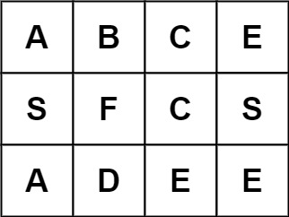

# Word Search

Given an `m x n` grid of characters `board` and a string `word`, return `true` _if_ `word` _exists in the grid_.

The word can be constructed from letters of sequentially adjacent cells, where adjacent cells are horizontally or vertically neighboring. The same letter cell may not be used more than once.

---

##### Example 1 Visualization

##### Example 2 Visualization

##### Example 3 Visualization

